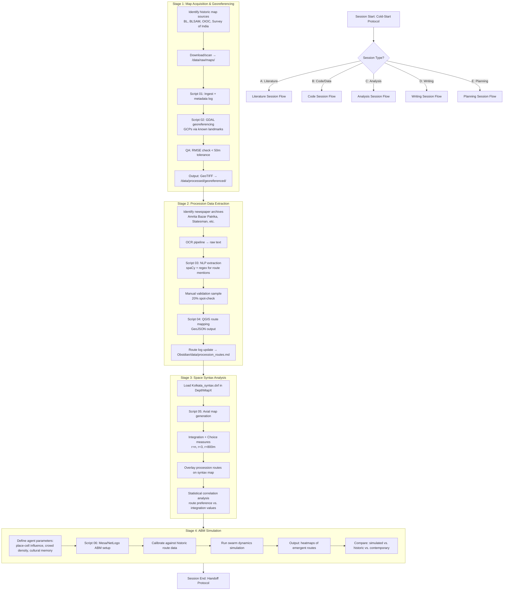

# PhD Research — Master Process Flow & Session Orchestration
**Project:** Spatio-Cultural Dynamics: Mapping Kolkata's Historical Processional Routes  
**PI:** Spandita Pramanik | UCL Bartlett Space Syntax Lab  
**Vault:** `~/Documents/phd-vault/` | **Repo:** `colonial-map-pipeline` | **Notion Hub:** `notion.so/35682b180df181c2b9cfdcba5718ab76`  
**Updated:** 2026-05-07

---

## 0. BEFORE YOU DO ANYTHING — SESSION COLD-START PROTOCOL

Every session begins with this exact sequence. No exceptions.

```bash
# 1. Orient via Git (primary memory)
cd ~/Documents/colonial-map-pipeline
git log --oneline -15
git status

# 2. Load Obsidian handoff doc (session state)
cat ~/Documents/phd-vault/handoffs/LATEST_HANDOFF.md

# 3. Check Notion task board (via MCP or browser)
# → notion.so/35682b180df181c2b9cfdcba5718ab76
# Read: Active Sprint column + any Blocker flags

# 4. Declare session type before proceeding:
# A = Literature | B = Code/Data | C = Analysis | D = Writing | E = Planning
```

**Rule:** If any of steps 1–3 fails (file missing, git error, Notion unreachable), stop and fix the pointer before doing research work. A broken memory system is worse than no memory.

---

## 1. MEMORY ARCHITECTURE — HOW THE THREE SYSTEMS CONNECT

```
┌─────────────────────────────────────────────────────────────────┐
│                    MEMORY LAYER DIAGRAM                         │
├─────────────────┬─────────────────────┬────────────────────────┤
│   GIT (Code)    │  OBSIDIAN (Process) │   NOTION (State)       │
│   Truth Layer   │  Knowledge Layer    │   Coordination Layer   │
├─────────────────┼─────────────────────┼────────────────────────┤
│ • Every script  │ • Session handoffs  │ • Sprint board         │
│ • Every dataset │ • Theory notes      │ • Task status          │
│ • Pipeline runs │ • Method decisions  │ • Milestone tracking   │
│ • Commit = log  │ • Mermaid diagrams  │ • Shared with advisor  │
│   of WHAT       │   of HOW & WHY      │   (external view)      │
└─────────────────┴─────────────────────┴────────────────────────┘
         │                  │                       │
         └──────────────────┴───────────────────────┘
                     Linked via:
         Git commit msg → Obsidian filename
         Obsidian note → Notion page ID in frontmatter
         Notion task → Git branch name (e.g. feat/procession-nlp)
```

### 1.1 Linking Protocol (enforced in every session)

**Git commit message format:**
```
[SESSION-TYPE][DATE] Short description

Obsidian-ref: YYYYMMDD_handoff_<slug>.md
Notion-page: <page-id-last-8-chars>
Next: <one-line description of immediate next step>

Files changed: <list>
Blockers: <none | description>
```

**Obsidian note frontmatter (every handoff file):**
```yaml
---
date: YYYY-MM-DD
session_type: A|B|C|D|E
git_commit: <sha>
notion_page_id: <id>
status: active|parked|complete
next_action: "<exact next command or task>"
---
```

**Obsidian file naming:**
```
~/Documents/phd-vault/handoffs/YYYYMMDD_handoff_<session-slug>.md
```
`LATEST_HANDOFF.md` is always a symlink to the most recent file:
```bash
ln -sf ~/Documents/phd-vault/handoffs/YYYYMMDD_handoff_<slug>.md \
        ~/Documents/phd-vault/handoffs/LATEST_HANDOFF.md
```

---

## 2. VAULT STRUCTURE — OBSIDIAN DIRECTORY LAYOUT

```
~/Documents/phd-vault/
├── 00_INDEX.md                    ← Master map of all notes
├── handoffs/
│   ├── LATEST_HANDOFF.md         ← symlink to most recent
│   └── YYYYMMDD_handoff_*.md     ← one per session
├── theory/
│   ├── space_syntax_core.md
│   ├── griffiths_space_agent.md   ← Prof. Griffiths thesis
│   ├── processional_culture.md
│   └── colonial_urbanism.md
├── methodology/
│   ├── pipeline_architecture.md   ← Full pipeline Mermaid diagram
│   ├── georeferencing_protocol.md
│   ├── nlp_extraction.md
│   ├── abm_design.md
│   └── depthmapx_workflow.md
├── data/
│   ├── map_inventory.md           ← All historic maps, status, sources
│   ├── procession_routes.md       ← Route log with GeoJSON filenames
│   └── newspaper_sources.md       ← Archives accessed, date ranges
├── literature/
│   ├── reading_log.md             ← Papers read, status, key claims
│   ├── citation_map.md            ← Litmaps export notes
│   └── gaps.md                    ← Literature gaps to fill
├── code/
│   ├── script_log.md              ← Every script, what it does, test status
│   └── environment_setup.md       ← Conda env, QGIS path, dependencies
└── admin/
    ├── ucl_website_profile.md     ← Research profile (timestamped)
    └── advisor_meeting_notes.md
```

**Setup command (run once):**
```bash
mkdir -p ~/Documents/phd-vault/{handoffs,theory,methodology,data,literature,code,admin}
touch ~/Documents/phd-vault/00_INDEX.md
```

---

## 3. REPOSITORY STRUCTURE — GIT LAYOUT

```
~/Documents/colonial-map-pipeline/
├── README.md                      ← Links to Notion hub + Obsidian vault path
├── .git/
├── data/
│   ├── raw/
│   │   ├── maps/                  ← Scanned historic maps (TIFF)
│   │   └── newspapers/            ← Raw OCR output / PDFs
│   ├── processed/
│   │   ├── georeferenced/         ← GeoTIFF outputs
│   │   └── routes/                ← GeoJSON procession routes
│   └── syntax/
│       └── Kolkata_syntax.dxf
├── scripts/
│   ├── 01_map_ingestion.py
│   ├── 02_georeferencing.py
│   ├── 03_nlp_extraction.py
│   ├── 04_route_mapping.py
│   ├── 05_syntax_analysis.py      ← Space syntax integration
│   └── 06_abm_simulation.py
├── notebooks/
│   └── exploratory/
├── tests/
│   ├── tests.json                 ← Autonomous test tracker
│   └── test_*.py
├── outputs/
│   ├── figures/
│   └── reports/
└── docs/
    └── pipeline_spec.md
```

**Branch naming convention:**
```
main          ← stable, tested only
dev           ← integration branch
feat/<slug>   ← feature work (e.g. feat/nlp-procession-extraction)
fix/<slug>    ← bug fixes
exp/<slug>    ← experimental (may be discarded)
```

---

## 4. THE RESEARCH PIPELINE — FULL PROCESS FLOW



---

## 5. SESSION-TYPE FLOWS

### 5A — Literature Session (Type A)

```
1. Open Obsidian: literature/reading_log.md → find next unread paper
2. Load paper in Scite MCP or local PDF
3. Extract: core claim | method | spatial argument | gaps
4. Add to reading_log.md with status: [read]
5. Cross-link to theory/ notes if relevant
6. If gap found → add to literature/gaps.md
7. If citable for a chapter → add to Notion writing task
8. Commit: git add phd-vault/ && git commit -m "[A][date] Read <author_year>: <claim>"
9. Write handoff → update LATEST_HANDOFF symlink
```

### 5B — Code/Data Session (Type B)

```
1. git checkout dev (or relevant feat/ branch)
2. Read script_log.md → find next script to build/test
3. Write script → save to /scripts/
4. Run Autonomous Write-Test Cycle:
   a. Write test in tests/ → update tests.json
   b. Run: pytest tests/test_<script>.py -v
   c. If FAIL: debug → fix → re-run (no manual undo)
   d. If PASS: commit immediately
5. Update script_log.md: status → [tested-pass]
6. Push to remote: git push origin dev
7. Write handoff
```

### 5C — Analysis Session (Type C)

```
1. Load relevant GeoJSON + DXF from /data/processed/
2. Run syntax analysis (Script 05) — check RMSE log
3. Generate correlation table
4. Export figure → /outputs/figures/
5. Write interpretation note → methodology/depthmapx_workflow.md
6. Flag any anomalies in Obsidian → create Notion task if blocking
7. Commit outputs + notes
8. Write handoff
```

### 5D — Writing Session (Type D)

```
1. Open Notion: find active chapter/section task
2. Load relevant Obsidian notes (theory/ + methodology/)
3. Draft in Markdown → save to /docs/ in repo
4. Cross-check claims against reading_log.md
5. Flag uncited claims → add to Notion review task
6. Commit draft: [D][date] Draft: <chapter/section name>
7. Write handoff
```

### 5E — Planning Session (Type E)

```
1. Review Notion board: completed / blocked / upcoming
2. Review git log for last 10 commits → assess velocity
3. Identify next 3 concrete deliverables (not vague goals)
4. Update Notion sprint column
5. Update 00_INDEX.md in Obsidian
6. Write handoff with explicit next-session instructions
```

---

## 6. SESSION-END HANDOFF PROTOCOL

**This is mandatory. No session ends without it.**

```bash
# Step 1: Write handoff file
SLUG="<session-descriptor>"
DATE=$(date +%Y%m%d)
HANDOFF="$HOME/Documents/phd-vault/handoffs/${DATE}_handoff_${SLUG}.md"

cat > "$HANDOFF" << 'EOF'
---
date: YYYY-MM-DD
session_type: B
git_commit: <run: git rev-parse --short HEAD>
notion_page_id: <page-id>
status: active
next_action: "run pytest tests/test_03_nlp.py after fixing regex on line 47"
---

## What Was Done
- <bullet: specific, not vague>

## State of Each Component
- Script 03: regex draft complete, untested
- Script 04: not started
- Obsidian/data/procession_routes.md: updated with 3 new routes

## Blockers
- OCR quality on 1890 Statesman scans is poor — need Tesseract parameter tuning

## Next Session Must Start With
1. `git checkout feat/nlp-procession-extraction`
2. Run: `pytest tests/test_03_nlp.py -v`
3. Fix line 47 regex before anything else

## Do Not Forget
- Email UCL library re: access to OIOC map collection
EOF

# Step 2: Update symlink
ln -sf "$HANDOFF" ~/Documents/phd-vault/handoffs/LATEST_HANDOFF.md

# Step 3: Commit everything
cd ~/Documents/colonial-map-pipeline
git add .
git commit -m "[B][${DATE}] <description>

Obsidian-ref: ${DATE}_handoff_${SLUG}.md
Notion-page: <last-8-of-page-id>
Next: <one-liner>
Blockers: <none|description>"

# Step 4: Push
git push origin <current-branch>
```

---

## 7. NOTION ↔ OBSIDIAN SYNC RULES

| Notion Column | Obsidian Action |
|---|---|
| **Backlog** | Entry in relevant `gaps.md` or `script_log.md` |
| **Active Sprint** | Open handoff note exists + `status: active` |
| **Blocked** | Blocker documented in handoff under `## Blockers` |
| **Done** | Obsidian note `status: complete` + git commit SHA recorded in Notion |
| **Advisor Review** | Note moved to `admin/advisor_meeting_notes.md` |

**Sync frequency:** At start + end of every session. Not mid-session (too disruptive).

---

## 8. AUTONOMOUS WRITE-TEST CYCLE (enforced for all scripts)

```
For every script in /scripts/:

WRITE → TEST → VERIFY → COMMIT (never skip steps)

tests.json entry format:
{
  "script": "03_nlp_extraction.py",
  "test_file": "tests/test_03_nlp.py",
  "status": "pass|fail|untested",
  "last_run": "YYYY-MM-DD",
  "coverage": ["route detection", "date parsing", "edge: no route mentioned"],
  "blocker": null
}

If status = fail after 3 iterations:
→ Park in exp/ branch
→ Document failure mode in Obsidian/code/script_log.md
→ Create Notion task: "Debug Script 03 — regex failure on pre-1900 text"
→ Move on. Do not spiral.
```

---

## 9. RESEARCH PROFILE UPDATE PROTOCOL (UCL Website)

File: `~/Documents/phd-vault/admin/ucl_website_profile.md`

Update trigger: After any of these events:
- New paper added to reading log (if it reframes your argument)
- A script passes all tests (= new methodological capability)
- A chapter draft is complete
- Supervisor meeting with directional feedback

Format:
```markdown
## Research Profile — Last Updated: YYYY-MM-DD HH:MM

### Current Focus
<1 sentence: what you are actively working on>

### Methodological Capabilities (Live)
- [x] Historic map georeferencing pipeline (Script 01–02: tested)
- [ ] NLP procession route extraction (Script 03: in progress)
- [ ] Space Syntax correlation analysis
- [ ] ABM swarm simulation

### Key Argument (Working Thesis)
<2–3 sentences: your current best articulation>

### Recent Milestones
| Date | Achievement |
|------|------------|
| YYYY-MM-DD | ... |
```

---

## 10. QUICK-REFERENCE CHEATSHEET

```
COLD START:
  git log --oneline -15 && git status
  cat ~/Documents/phd-vault/handoffs/LATEST_HANDOFF.md

NEW HANDOFF FILE:
  ~/Documents/phd-vault/handoffs/YYYYMMDD_handoff_<slug>.md
  ln -sf <file> ~/Documents/phd-vault/handoffs/LATEST_HANDOFF.md

COMMIT FORMAT:
  [TYPE][DATE] Description
  Obsidian-ref: filename.md | Notion-page: xxxxxxxx | Next: ...

DATA PATHS:
  Raw maps:     ~/Documents/colonial-map-pipeline/data/raw/maps/
  GeoTIFF out:  ~/Documents/colonial-map-pipeline/data/processed/georeferenced/
  Routes:       ~/Documents/colonial-map-pipeline/data/processed/routes/
  Scripts:      ~/Documents/colonial-map-pipeline/scripts/
  UCL OneDrive: /Users/xon/UCL-OD/

SESSION TYPES: A=Lit B=Code C=Analysis D=Writing E=Planning

BRANCH → SCRIPT MAP:
  feat/georeferencing      → scripts/01,02
  feat/nlp-extraction      → scripts/03
  feat/route-mapping       → scripts/04
  feat/syntax-analysis     → scripts/05
  feat/abm-simulation      → scripts/06
```

---

*This document lives at: `~/Documents/colonial-map-pipeline/docs/MASTER_PROCESS_FLOW.md`*  
*Mirror in Obsidian: `~/Documents/phd-vault/methodology/pipeline_architecture.md`*  
*Notion page: 35682b180df181c2b9cfdcba5718ab76*
